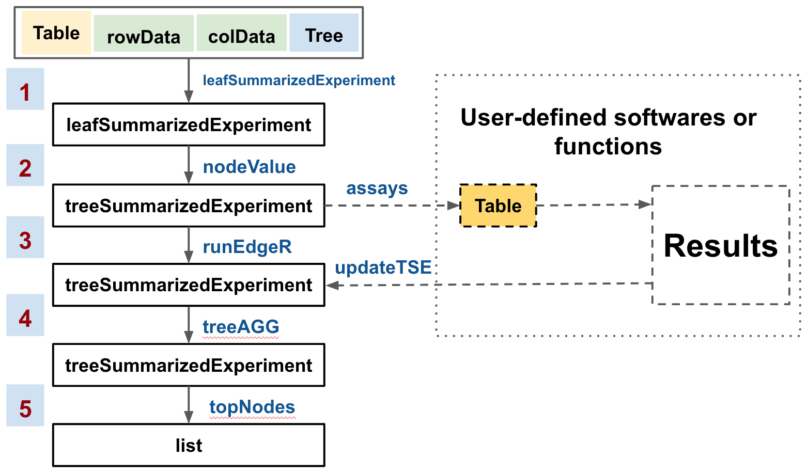

```{r setup, include=FALSE}
knitr::opts_chunk$set(echo = TRUE, message = FALSE, warning = FALSE)
```

# Introduction

The arrangement of hypotheses in a hierarchical structure appears in many
research fields and often indicates different resolutions at which data can be
viewed and results can be interpreted. Examples include studies of microbial
abundance where the OTUs (operational taxonomic units, often assumed to
represent species) can be arranged as leaves in a phylogenetic tree, and
single-cell studies where the individual cells can be organized hierarchically ,
e.g. via clustering. In both these examples, a question arises on which
resolution level the signal in the data (e.g. differential abundance of features
between groups) is best interpreted, or put another way, on what resolution the
main 'driver' of the signal can be found. For example, in the microbial
abundance data, a whole family of species may react similarly to a particular
stimulus. In such situations, it would be more informative to summarize the
differential abundance analysis at this level of resolution, rather than
providing a long list of individual differentially abundant OTUs. An additional
reason for aggregating data to higher levels of the phylogenetic tree is that
the abundances of individual species or OTUs may be low, limiting the power of
the statistical test to pick up any significant differences, whereas by
aggregating the signal from multiple related OTUs, the detection power can be
increased. For the single-cell data example, similarly, if a treatment truly
acts on a high level, affecting the abundance of, e.g., all B-cells, it is
helpful if this is picked up by the analysis pipeline, rather than returning a
large number of significantly differentially abundant subclusters of the main
B-cell cluster. The `r Biocpkg("treeAGG")` package is designed to analyze data
that can be organized in a hierarchical structure, and to find the most
informative resolution at which to interpret the signal of interest.

# Methods {#flowchart}

## The main structure of the pipeline provided in `r Biocpkg("treeAGG")`
```{r flowchart, echo=FALSE, fig.cap= "The workflow of treeAGG package."}

```

In the `r Biocpkg("treeAGG")` package, we provide a easy-to-use pipeline (Figure
\@ref(fig:flowchart)) to perform statistical tests for each leaf and internal
node of a hierarchical structure, and aggregate the results to find the most
informative resolution for interpretation. The starting point for the analysis
is a hierarchical structure (e.g., a phylogenetic tree), a data matrix with
values for all leaves in this hierarchical structure, and annotation tables for
rows and columns of the matrix. From here, users can follow the standard five
steps outlined in Figure \@ref(fig:flowchart) to derive data values for each
internal node, perform a statistical test for each node, and aggregate the
results of these tests to find an optimal resolution for interpretation.
Alternatively, the extended data matrix can be extracted for customized
analysis, the results of which can be integrated back into the 
`r Biocpkg("treeAGG")` pipeline for aggregation. The table extracted after step
2 has more rows than the original table because it includes data for entities
corresponding to the internal nodes of the tree. In each step, we have listed
the available functions to do it in blue texts. The details about each steps are
summarized below.

* Step 1: Data preparation. Store data on the level of leaf nodes in a
`leafSummarizedExperiment` container. More details about the construction of a
`leafSummarizedExperiment` object could be found in the vignette *Introduction
to leafSummarizedExperiment and treeSummarizedExperiment*.

* Step 2: Data preparation. Derive data on the level of internal nodes and store
data on all nodes in a `treeSummarizedExperiment` container. More details about
the construction of a `treeSummarizedExperiment` object could be found in the
vignette *Introduction to leafSummarizedExperiment and
treeSummarizedExperiment*.

* Step 3: Data analysis. Users could use the available wrapper function
`runEdgeR` if differential analysis of counts is desired, or other suitable
software to do customized analysis. Individual hypotheses at tree leaves and
internal nodes are tested simultaneously and the Benjamin-Hochberg procedure to
control the FDR is used. Nominal and adjusted p-values for each node are
required to do tree aggregation.

* Step 4: Tree aggregation. Start from the leaf nodes of the tree. Compare
p-values on leaf nodes to that on their parent node. If the minimum value is on
the parent node, take the parent node; otherwise, take the leaf nodes and
compare them to nodes on a higher level. Here, we refer the root node as the
highest level. Repeat the comparison until you reach the root. Check the nodes
finally left and keep only those where the null hypothesis is rejected.

We suggest users to come back to this workflow (Figure \@ref(fig:flowchart))
after they read Section \@ref(analysis) and Section \@ref(aggregation).

## Details about the tree aggregation

Consider the case that we have a table that contains measurments of entities
collected from samples under different conditions (the phenotypic outcome), and
a tree that represents the hierarchical structure of the entities. The table is
organized in a way that entities are in the rows and samples are in the columns.
To arrange hypotheses in the hierarchical structure, we need that each node of
the tree could mapped to a row of the table. However, in most case, only the
data of entities corresponding to the leaf nodes of the tree could be observed,
and the data for the internal nodes have to be generated based on the observed
values of their descendant leaf nodes. Users can choose any reasonable method to
generate data for the entities corresponding to internal nodes. For abundance,
we suggest to create the data of an internal node by summing the count of its
descendant leaf nodes.

With the data ready, we could test the null hypothesis, which states that there
is no association between the abundance change and the phenotypic outcome, at
each node. Multiple testing correction methods, such as the Benjamin-Hochberg
procedure, could be applied then to decide whether the null hypothesis at a node
should be rejected.

It's likely that an internal node found to be significantly associated with the
phenotypic outcome is due to some of its descendant nodes. In other words, only
some of its descendant nodes are phenotypic outcome associated and this signal
is not diluted enough by other descendant nodes that are not phenotypic outcome
associated. In the tree aggregation step, we aim to pinpoint the nodes that
drive the association.

To do tree aggregation, we need the p-value derived from the analysis above at
each node. The algorithm starts from the leaf nodes of the tree.

1. Compare the p-values on the leaf nodes with those on their respective parent
node. If the minimum value is on the parent node, select the parent node;
otherwise, select the leaf nodes.
2. Compare the selected nodes to nodes on a higher level as previous step. Here,
we refer the root node as the highest level.
3. Repeat the comparison until you reach the root. 
4. Check the nodes finally left and keep only those whose null hypotheses are
rejected.

# Data preparation

Load the packages below before the start of analysis.  
```{r}
suppressPackageStartupMessages({
  library(treeAGG)
  library(edgeR)
  library(S4Vectors)
  library(ggtree)
})
```
The data analysis includes two steps. One is to do the hypothesis test on each
node, the other is to combine these results with the tree structure to do tree
aggregation. The `r Biocpkg("treeAGG")` package provides functions to do the
second step, and users are free to perform their testing using any suitable
software. Here, as an example, we show the DA test step performed with the 
`r Biocpkg("edgeR")` package. `r Biocpkg("S4Vectors")` might be required in the
data preparation step to create `DataFrame` objects.

A count table and a tree structure are required to do data analysis. Here, we
use a semi-simulated cytof data [@Weber2018] as an example. More details could
be found via `?cytofCount`. As the tree structure is not a `phylo` object, we
need to convert it via `as.phylo` from `r CRANpkg("ape")`.

```{r}
# count table
data("cytofCount")
count <- DataFrame(cytofCount)

# tree structure
data("cytofTree")
class(cytofTree)

# convert to the phylo class
library(ape)
Tree <- as.phylo(cytofTree)

```


The information for each cell cluster, corresponding to a row in the count
table, is given in the `cytofCluster` (see `?cytofCluster` for more details).

```{r}
# row information 
# add a column called nodeLab to tell which node a row corresponds to.
data("cytofCluster")
cytofCluster <- DataFrame(cytofCluster)
cytofCluster$nodeLab <- cytofCluster$cluster
```

We add a new column named as `nodeLab` to record which node of the tree a row of
the count table corresponds to. If such a column is not given, the rownames of
the `cytofCluster` is used for the mapping. Users should make sure that the
column `nodeLab` or the row names use node labels of the tree. When both exist
and are different, the `nodeLab` column is used.

The information of each sample (a column in the count table) is
given in the `cytofSample` (see `?cytofSample` for more details).

```{r}
# provide sample information: from healthy or CN group
data("cytofSample")
```

We could store the above data in a `leafSummarizedExperiment` container. More
details about the `leafSummarizedExperiment` class could be found in the help
page `?leafSummarizedExperiment` or in the vignette *Introduction to
leafSummarizedExperiment and treeSummarizedExperiment*.
```{r}
# construct a leafSummarizedExperiment object to include tree structure, count,
# cluster information and sample information
lse <- leafSummarizedExperiment(tree = Tree,
                                assays = list(count),
                                rowData = cytofCluster,
                                colData = cytofSample)
lse
```

The abundance table in *lse* only provides the counts (abundances) of clusters
at tree leaf level.  We generate counts of internal nodes by summing the counts
of their descendants using the `nodeValue` function. The output
*tse* is a `treeSummarizedExperiment` object. More details about the
`treeSummarizedExperiment` class could be found in the help page
`?treeSummarizedExperiment` or in the vignette *Introduction to
leafSummarizedExperiment and treeSummarizedExperiment*.

```{r}
tse <- nodeValue(data = lse, fun = sum, message = TRUE)
class(tse)
```

There are more rows in the count table stored in `assays` of *tse* than *lse*.
These new generated rows corresponds to the internal nodes of the tree.
```{r}
dim(assays(lse)[[1]])
dim(assays(tse)[[1]])
```

The `rowData` dimension changes coordinately. 
```{r}
dim(rowData(lse))
dim(rowData(tse))
```

The row information of an internal node is decided by that of all its
descendants. If there are different values for the descendants, `NA` is used for
the internal node; otherwise, the internal node shares the same value as its
desendants. Here, for example, the column *truth* provides the information
whether a cell cluster is truly differentially abundant. The cluster, which
corresponds to an internal node of a tree, would have value `TRUE` in the
*truth* column if all its descendant clusters have *truth* and have value `NA`
in *truth* column if its descendant clusters have different values for *truth*.
```{r}
# select a cluster that corresponds to an internal node of the tree and has TRUE
# in the 'truth' column
sel <- which(rowData(tse)$truth & !linkData(tse)$isLeaf)[1]
rowData(tse)[sel, ]

# find the descendant nodes of the selected internal node
desd <- findOS(tree = treeData(tse), 
               ancestor = linkData(tse)$nodeNum[sel], 
               only.Tip = TRUE, return = "number")

# The descendants all have TRUE in the 'truth' column
rowData(tse)[match(desd, linkData(tse)$nodeNum), ]

```


# Differential abundance analysis {#analysis}
## Analysis on a single table

In a `treeSummarizedExperiment` object, multiple tables can be stored as
`assays`. Users could choose to perform analysis on one of them or on multiple
assays simultaneously. We start to show you how to do it on a single table.
There are two options to do it.

* Option 1: use functions from `r Biocpkg("edgeR")`. This is more flexible and
allows more customized settings.

* Option 2: use the function `runEdgeR` from `r Biocpkg("treeAGG")`. It's a
wrapper using functions from `r Biocpkg("edgeR")`.

### Option 1: Use `r Biocpkg("edgeR")` {#option1}

Extract the count table to do data analysis. To make sure we know which row
corresponds to which node of the tree, we need to use `use.nodeLab = TRUE`. It
might lead to errors in the tree aggregation step if users forget to set
`use.nodeLab = TRUE`.
```{r}
# extract the abundance table
count <- assays(tse, use.nodeLab = TRUE)[[1]]
```

Then, we follow the routine steps of using the `r Biocpkg("edgeR")` package to
perform differential abundance analysis as below.
```{r}
# calculate total count for each sample
# The total count is the sum of cell counts of clusters on the leaf level of the
# tree.
tip_tse <- tse[linkData(tse)$isLeaf, ]
tipCount <- assays(tip_tse, use.nodeLab = TRUE)[[1]]
libSize <- apply(tipCount, 2, sum)

# create DGEList
y <- DGEList(counts = count, lib.size = libSize,
             remove.zeros = FALSE)

# calculate normalisation factors
y <- calcNormFactors(object = y, method = "TMM")

# construct design matrix
sample_inf <- colData(tse)
design <- model.matrix(~ subject + group, data = sample_inf)

# estimate dispersion
y <- estimateGLMRobustDisp(y, design = design)

# fit the negative binomial GLMs
fit <- glmFit(y, design = design, prior.count = 0.125)

# run likelihood ratio tests 
# contrast is not specified here, so the last coefficient is tested.
lrt <- glmLRT(fit, contrast = NULL)

# Use Benjamin-Hochberg method to do multiple testing correction
# n is set to Inf below, because we want to have the results of all entities.
out <- topTags(lrt, n = Inf, adjust.method = "BH")$table
head(out)
```
The output *out* has five columns, one of which is the nominal p-value
(*PValue*) and one is the adjusted p-value named *FDR*. These columns are
required by the tree aggregation step. If users choose other softwares to do
analysis, we expect they could finally get results similar to *out* with columns
containing nominal and adjusted p-values and each row representing a node of the
tree structure. We could further store the result in the `rowData` of *tse* via
the function `updateTSE`.

```{r}
# put *out* in a list. 
outList <- list(assay1 = list(out))
new_tse1 <- updateTSE(result = outList, tse = tse, 
                      use.assays = 1, design = design, 
                      contrast = NULL, fit = fit)
```
The result *out* is changed to a list object *outList* before it is assigned to
the argument `result`. The reason to do it could be seen later in the section
\@ref(multipleTable) where analysis on multiple tables with multiple contrasts
are performed. To update the `treeSummarizedExperiment` object (`tse = tse`),
the result (`result = outList`) and the information, such as the design matrix
(`design`), the contrasts (`contrast`) and the number of matrix-like elements in
`assays` (`use.assays`), should be provided. We could also optionally store the
result *fit* created by the `glmFit` function for later use, for example, to
quickly get new result when specifying a new contrast.

In the `rowData`, a new column *result_assay1*, which is only visible with
`internal = TRUE` , is created to store the result gained from the first assay
table. This new column has a new class `internal_rowData` that indicates it's
the internal part of the `rowData` and is only visible with `internal = TRUE`.
We don't recommend users to modify columns belonging to the internal part of the
`rowData` as they are required for the tree aggregation step.
```{r}
# the result gained from the first assay table
(res <- rowData(new_tse1, internal = TRUE)$result_assay1)
```

As we didn't specify contrast (`contrast = NULL`) in the analysis, there is only
a column `contrastNULL`.
```{r}
# the result gained with contrast = NULL
res$contrastNULL
```

If users want to see only the original row data, it could be achieved by
specifying `internal = FALSE`.
```{r}
rowData(new_tse1, internal = FALSE)
```


### Option 2: Wrapper function

In the package `r Biocpkg("treeAGG")`, we have provided a wrapper function to do
the work of section \@ref(option1) in one step.

```{r}
new_tse2 <- runEdgeR(obj = tse, use.assays = 1,
                     design = NULL, contrast = NULL, 
                     normalize = TRUE, method = "TMM", 
                     adjust.method = "BH")
new_tse2
```
The prepared data *tse* is assigned to the `obj` argument. If there are more
than one matrix-like elements in the `assays`, we could use `use.assays` to
select which elements will be used for analysis. Here, the first matrix-like
element will be used as `use.assays = 1`. Users could customize the design
matrix and contrasts via `design` and `contrast`, respectively, and they will be
saved in the `metadata` of the output for later check. If they are not given,
the wrapper function will by default use `colData` to generate a design matrix
and test the last coefficient in the `glmLRT` step.

## Analysis on multiple tables of `assays` {#multipleTable}

In this section, we show how to perform analysis simultaneously on multiple
elements of `assays` with multiple contrasts.

We create a new `treeSummarizedExperiment` object *tseM* with 3 `elements` in
the `assays` and the other slots exactly the same as *tse*.
```{r}
# extract the abundace table
count <- assays(tse, use.nodeLab = TRUE)[[1]]

# new treeSummarizedExperiment with three tables in the assays
countList <- list(count, (2*count), (3*count) )
tseM <- treeSummarizedExperiment(assays = countList,
                                 tree = treeData(tse), 
                                 linkData = linkData(tse),
                                 rowData = rowData(tse),
                                 colData = colData(tse))
```

Analysis on the first and the third elements of `assays` can be done in one
step. We feed *tseM* to the `obj`, tell R to use the first and third tables
`use.assays = c(1, 3)`, and specify the design and contrasts via `design` and
`contrast`. The output is *new_tseM*. 

```{r}
contrastList <- list(contrast1 = NULL, 
                     contrast2 = c(0, 0, 0, 1, -1, 0))
new_tseM <- runEdgeR(obj = tseM, use.assays = c(1, 3), 
                     design = NULL,
                     contrast = contrastList,
                     normalize = TRUE, method = "TMM", 
                     adjust.method = "BH")
new_tseM
```
There are now 7 columns in the `rowData`. The two new columns are
the analysis results from the first and third elements of `assays`,
*result_assay1*, and *result_assay3*.  

If users want to do some customized settings, they could do it similarly as
section \@ref(option1).

```{r}
count1 <- assays(tseM, use.nodeLab = TRUE)[[1]]
count3 <- assays(tseM, use.nodeLab = TRUE)[[3]]


# calculate library size
count1.t <- assays(tseM[linkData(tseM)$isLeaf, ],
                   use.nodeLab = TRUE)[[1]]
count3.t <- assays(tseM[linkData(tseM)$isLeaf, ], 
                   use.nodeLab = TRUE)[[3]]
libSize1 <- apply(count1.t, 2, sum)
libSize3 <- apply(count3.t, 2, sum)

# create DGEList
y1 <- DGEList(counts = count1, lib.size = libSize1,
              remove.zeros = FALSE)
y3 <- DGEList(counts = count3, lib.size = libSize3, 
              remove.zeros = FALSE)

# calculate normalisation factors
y1 <- calcNormFactors(object = y1, method = "TMM")
y3 <- calcNormFactors(object = y3, method = "TMM")

# construct design matrix
sample_M <- colData(tseM)
designM <- model.matrix(~ subject + group, data = sample_M)

# estimate dispersion
y1 <- estimateGLMRobustDisp(y1, design = designM)
y3 <- estimateGLMRobustDisp(y3, design = designM)

# fit the negative binomial GLMs
fit1 <- glmFit(y1, design = designM)
fit3 <- glmFit(y3, design = designM)

# run likelihood ratio tests 
# using different contrasts
lrt1.1 <- glmLRT(fit1, contrast = NULL)
lrt1.2 <- glmLRT(fit1, contrast = c(0, 0, 0, 1, -1, 0))

lrt3.1 <- glmLRT(fit3, contrast = NULL)
lrt3.2 <- glmLRT(fit3, contrast = c(0, 0, 0, 1, -1, 0))

# Use Benjamin-Hochberg method to do multiple testing correction
# n is set to Inf below, because we want to have the results of all entities.
out1.1 <- topTags(lrt1.1, n = Inf,
                  adjust.method = "BH")$table
out1.2 <- topTags(lrt1.2, n = Inf, 
                  adjust.method = "BH")$table

out3.1 <- topTags(lrt3.1, n = Inf, 
                  adjust.method = "BH")$table
out3.2 <- topTags(lrt3.2, n = Inf, 
                  adjust.method = "BH")$table
```
Now, we have four result tables. To write the results back to *tseM*, we could
use the function `updateTSE`.

```{r}
# put the contrasts used as a list and name the contrasts
contrastList <- list(contrast1 = NULL, contrast2 = c(0, 0, 0, 1, -1, 0))

# put the four result tables as a list
resultList <- list(assay1 = list(contrast1 = out1.1, 
                                 contrast2 = out1.2), 
                   assay3 = list(contrast1 = out3.1, 
                                 contrast2 = out3.2))

# write the result back to the tseM
new_tseM2 <- updateTSE(result = resultList, 
                       tse = tseM, 
                       use.assays = c(1, 3),
                       design = designM,
                       contrast = contrastList, 
                       fit = list(fit1, fit3))
```

* Results from the same assay table are stored in a list. They are named
according to their contrasts as *contrastList*.
* Results from different assay tables are further organized in a list. They are
named with the `assay` followed by the number that the element data is in the
`assays` of *tseM*.

```{r}
all.equal(new_tseM, new_tseM2)
```

# Tree aggregation {#aggregation}

The tree aggregation could be done in one step using the function `treeAGG`.
Based on the analysis output (`data = new_tseM`), we specify the column for the
aggregation via `agg.by`, and the column storing the adjusted p-value via
`sigf.by`. The threshold for the adjusted p-value can be assigned via
`sigf.limit`. To see the running process, `message = TRUE` is used.
```{r}
aggR <- treeAGG(data = new_tseM, sigf.by = "FDR", 
                sigf.limit = 0.05, agg.by = "PValue", 
                message = TRUE)
```

To print out the result, `topNodes` can be used. The output *aggR*  is assigned
to `data`. We could decide which result should be shown using `use.assays`.
Here, `use.assays = 1` is to show only results obtained from the first element
of `assays`. We could further specify how the rows should be ordered via
`sort.by` and `decreasing`. If some columns in `linkData` or `rowData` are also
needed, they could be extracted out simutaneously via `col.rowData` and
`col.linkData`, respectively.

```{r}
tabL <- topNodes(data = aggR, sort.by = "FDR", 
                 decreasing = FALSE,
                 use.assays = 1, col.rowData = NULL, 
                 col.linkData = "nodeNum")
```
Here, *tabL* is simply a list and users could extract any sub-elements by the
operations on the `list` class. Below, we will display the result gained with
the *contrast1* (the first contrast of *contrastList*).
```{r}
tabR <- tabL$result_assay1$contrast1
```
The tree aggregation adds a column named *aggKeep* to each result table. This
column includes values `TRUE` and `FALSE`. Those rows with value `TRUE`
correspond to nodes that are finally selected as the estimated optimal level to
interpret the differential abundance pattern on the tree.

# The visualisation of the result

The information of true differential abundance is stored in the column *truth*
of the `rowData`. We subset the `treeSummarizedExperiment` object *aggR* to keep
only nodes that are truly differentially abundant between patient and CN
samples, and use the function `signalNode` to extract the signal nodes. More
details about `signalNode` could be found in its help page ( `?signalNode` ).
```{r}
# Nodes that are truely differentially abundant
diffR <- aggR[rowData(aggR)$truth %in% TRUE, ]

# the true signal level 
trueLoc <- signalNode(tree = treeData(diffR),
                      node = linkData(diffR)$nodeNum)
```

The estimated optimal level to interpret the differential abundance pattern from
`r Biocpkg("treeAGG")` is as below. The node number (`nodeNum`) instead of the
node label is extracted because internal nodes might not have labels in the tree
provided.
```{r}
# the estimated signal level
estLoc <- tabR$nodeNum[tabR$aggKeep]
```

If the node label, instead of the node number, is of interest, `transNode` can
be used to do the transformaton. More details could be found in the help page
`?transNode`.

```{r}
# when there is no label for a node in the tree, NA is returned
transNode(tree = treeData(aggR), input = estLoc)

# if a character string for a node is really needed for some reasons, an alias
# could be used.
(aliasV <- transNode(tree = treeData(aggR),
                     input = estLoc,
                     use.alias = TRUE))

# the alias of the node label could be transformed back to the node number
(aliasN <- transNode(tree = treeData(aggR), input = aliasV))
estLoc == aliasN 
```

To compare the estimated results with the truth, we use `treePlot` to generate a
tree figure. The function `treePlot` is created based on 
`r Biocpkg("ggtree")`[Yu2017] and `r CRANpkg("ggplot2")`. The branches with blue
edges are truly differentially abundant. The results obtained from the minP
aggregation algorithm implemented in `r Biocpkg("treeAGG")` are shown as orange
points. Nodes labeled with orange points are the suggested as the optimal level
at which to interpret the signal.
```{r fig.height= 2}
p <- treePlot(tree = treeData(diffR) ,  
              branch = trueLoc,
              point = estLoc,
              zoomNode = c(trueLoc, estLoc),
              layout = "circular")
p
```


# References

