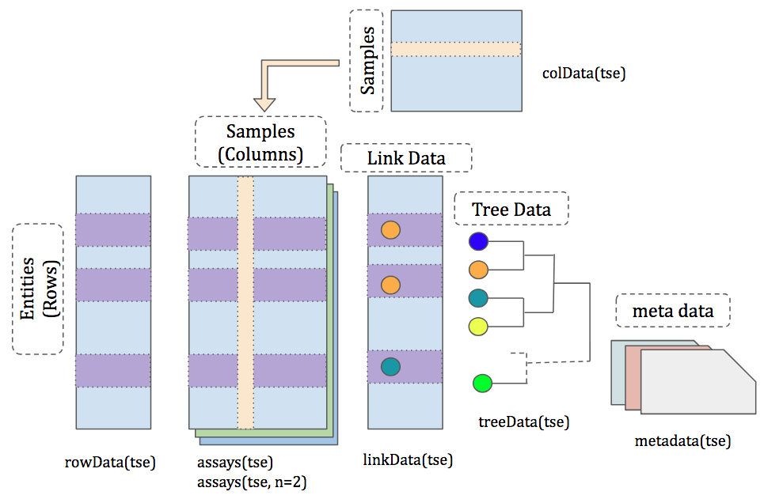

```{r setup, include=FALSE}
knitr::opts_chunk$set(echo = TRUE, message = FALSE, warning = FALSE)
```


# Introduction 

The `treeSummarizedExperiment` class is an extensions of the
`SummarizedExperiment` class. It's used to store rectangular data of
experimental results as in a `SummarizedExperiment`, and also support the
storage of a hierarchical structure and its link information to the rectangular
data. 

# treeSummarizedExperiment {#tse-class}

## Anatomy of treeSummarizedExperiment

```{r strTSE, echo=FALSE, fig.cap= "The structure of the treeSummarizedExperiment class."}

```
Compared with the `SummarizedExperiment` class, there are two more slots, the
tree data (`treeData`) and the link data (`linkData`), in the
`treeSummarizedExperiment` class. Other slots, including `assays`, `rowData`,
`colData` and `metadata`, are the same as those in `SummarizedExperiment`.


## The construction of treeSummarizedExperiment

We generate a *toyTable* with observations of 5 entities collected from 4
samples.
```{r}
suppressPackageStartupMessages({
    library(treeAGG)
    library(S4Vectors)})

# assays data
set.seed(1)
toyTable <- matrix(rnbinom(20, size = 1, mu = 10), nrow = 5)
colnames(toyTable) <- paste(rep(LETTERS[1:2], each = 2), 
                            rep(1:2, 2), sep = "_")
rownames(toyTable) <- paste("entity", seq_len(5), sep = "")

toyTable
```

Descriptions of the `r nrow(toyTable)` entities and `r ncol(toyTable)`
samples are given in the *rowInf* and *colInf*, respectively.
```{r}
# row data
rowInf <- DataFrame(var1 = sample(letters[1:2], 5, replace = TRUE),
                    var2 = sample(c(TRUE, FALSE), 5, replace = TRUE),
                    row.names = rownames(toyTable))
rowInf

# column data
colInf <- DataFrame(gg = c(1, 2, 3, 3),
                    group = rep(LETTERS[1:2], each = 2), 
                    row.names = colnames(toyTable))
colInf
```

The hierarchical structure of the 5 entities is denoted as *toyTree*. We create
it by using the function `rtree` from the package `r CRANpkg("ape")`. It's a
`phylo` object.
```{r}
# create a toy tree
suppressPackageStartupMessages(library(ape))
toyTree <- rtree(5)
class(toyTree)
```

As we see, the `phylo` object is actually a list of four elements.
```{r}
str(toyTree)
plot(toyTree)
```

To store the toy data, *toyTable*, *rowInf*, *colInf*, and *toyTree*, we could
use a `treeSummarizedExperiment` container. The map between the rows of
*toyTable* and the leaf nodes of *toyTree* is checked when creating a
`treeSummarizedExperiment` object. If the object is built as below, we get a
message that 5 rows of *toyTable* are removed because they can't be matched to
any node of the tree. The `assays` table of the resulting *test1* object
consequently has no rows.
```{r}
# use the toy data to create a treeSummarizedExperiment object.
test1 <- treeSummarizedExperiment(assays = list(toyTable), rowData = rowInf,
                                  colData = colInf, tree = toyTree)
assays(test1)[[1]]
```

To correctly store data, we need to additionally provide the link information
between the rows of *toyTable* and the nodes of the *toyTree* via a column
`nodeLab` in `rowData` or via the row names of `rowData`.

Option 1: Create a `treeSummarizedExperiment` object by changing the row names
of `rowData`.
```{r}
# change the row names of the row data
rowInf_1 <- rowInf
rownames(rowInf_1) <- toyTree$tip.label
toyTable_1 <- toyTable
rownames(toyTable_1) <- toyTree$tip.label
test2 <- treeSummarizedExperiment(assays = list(toyTable_1), 
                                   rowData = rowInf_1,
                                   colData = colInf, 
                                   tree = toyTree)
assays(test2)[[1]]
```

Option 2: Create a `treeSummarizedExperiment` object by adding a column
`nodeLab` to the `rowData`.
```{r}
# add a column (nodeLab) to the row data
rowInf$nodeLab <- toyTree$tip.label
lse <- treeSummarizedExperiment(assays = list(toyTable),
                                rowData = rowInf,
                                colData = colInf,
                                tree = toyTree)
assays(lse)[[1]]
```

Although the `treeSummarizedExperiment` object could be sucessfully created in
either way, the row names of the table in `assays` are different. We recommend
to do it as option 2 because it keeps the original row names and works better
especially when there are multiple rows mapped to a same leaf node of the tree.

If the data on internal nodes of the tree is available, we could stored it
similarly as above. If it needs to be generated from the values of their
descendant leaves, we could do it as shown in Section \@ref(agg).

## Data aggregation {#agg}

To aggregate data to a specific level of the tree, the function `nodeValue`
could be used. Here, we use it to aggregate data to all internal nodes of the
tree. The output of `nodeValue` is still a `treeSummarizedExperiment` object.
The argument `fun` specifies how the value at an internal node is calculated
from its descendant nodes. Here, the `sum` is used, and thus the value for each
node is equal to the sum of the values of all its descendants. To view the
running process, `message = TRUE` is used.

```{r}
tse <- nodeValue(data = lse, fun = sum, message = TRUE)
```

The output *tse* is a `treeSummarizedExperiment` object. The class
`treeSummarizedExperiment` is an extension of the `SummarizedExperiment` class.
```{r}
class(tse)
showClass("treeSummarizedExperiment")
```

As shown, there are two more slots, treeData and linkData, in
`treeSummarizedExperiment` compared with `SummarizedExperiment`.
```{r}
tse
```

### Assays
To extract a table in `assays` from `treeSummarizedExperiment` object, we could
use the `assays` accessor function. This is similar to the
`SummarizedExperiment` class.

```{r}
(aData <- assays(tse)[[1]])
```

We could use the node labels from the link data (\@ref(sec:linkData)) as the row
names via the argument `use.nodeLab = TRUE`. Commonly, the column `nodeLab` is
used as the row names. However, if it has duplicated values, the column
`nodeLab_alias` is used.

```{r}
assays(tse, use.nodeLab = TRUE)[[1]] 
```

The value at each node (from sample *A_1*) could be visualized with the
following figure. We see that the value at each internal node is the sum of
those at its descendant leaves.  More details about how to use 
`r Biocpkg("ggtree")` to plot the tree could be seen
[here](https://bioconductor.org/packages/release/bioc/html/ggtree.html).
```{r}
# load packages
suppressPackageStartupMessages({
    library(ggtree)  # to plot the tree
    })

# extract a sample column from assays 
ex1 <- assays(tse)[[1]][, 1, drop = FALSE]

# combine it with the data extracted from linkData
# rename column nodeNum as node
# optional : datF <- cbind.data.frame(ex1, linkData(tse)) %>%
# rename(node=nodeNum)
datF <- cbind.data.frame(ex1, linkData(tse)) 
colN <- colnames(datF)
colN[colN == "nodeNum"] <- "node"
colnames(datF) <- colN

# plot
ggtree(treeData(tse)) %<+% datF +
  geom_text2(aes(label = A_1), color = "brown1", size = 8)
```

The data *datF* is used to annotate the tree via `%<+%` (see `?"%<+%")

### Row data, column data and metadata 

The row data, column data, and metadata could be accessed exactly as in the
`SummarizedExperiment` class.

```{r}
(rData <- rowData(tse))
```

The column `nodeLab` is now moved to the `linkData` (see Section
\@ref(sec:linkData)), and isn't in the `rowData` (*rData*) of
`treeSummarizedExperiment` anymore.

```{r}
(cData <- colData(tse))
```

```{r}
# It is empty in the metadata
(mData <- metadata(tse))
```

### Link data {#sec:linkData}

The `linkData()` accessor is used to view the link information between rows of
matrix-like elements in the `assays` and nodes of the tree. 
```{r}
(linkD <- linkData(tse))
```
Rows of the link data are one-to-one mapped to rows of the matrix-like element
in `assays`. Their orders are exactly the same.  Each row of the matrix-like
element in `assays` could be mapped to a node of the tree, whose label and
number are in the column *nodeLab* and *nodeNum*, respectively. The column
*isLeaf* gives information whether a node is a leaf node. The column *rowID*
contains the corresponding row number in `assays`.

If the labels of nodes are available and unique on the tree, the link data would
have 4 columns including *nodeLab*, *nodeNum*, *isTip*, and *rowID*; otherwise,
it would have one additonal column *nodeLab_alias*.

As shown in the Figure \@ref(fig:toyTREE), the tree we have used has no labels 
(orange text) for internal nodes.

### Tree data

The tree structure could be accessed using `treeData()`. It is a `phylo` object. 
```{r}
treeD <- treeData(tse)
class(treeD)
```

The figure of the tree structure is shown in the Figure \@ref(fig:toyTREE). The
node label is given in orange text, and the node number is in blue.
```{r toyTREE, fig.cap="Rectangular layout of toyTree."}
ggtree(treeD) + 
    geom_text2(aes(label = label), color = "darkorange", 
               hjust = -0.1, vjust = -0.7, size = 6) +
    geom_text2(aes(label = node), color = "darkblue", 
               hjust = -0.5, vjust = 0.7, size = 5)
```

